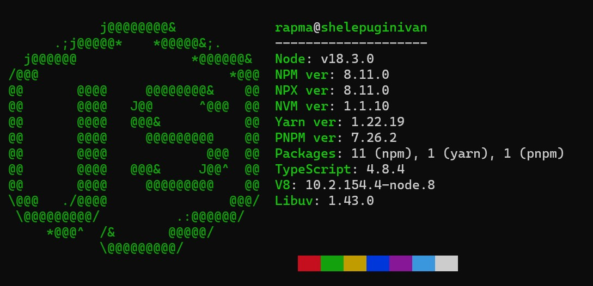

# nodefetch

Node.js information CLI tool.

## Screenshots

### Linux (on wsl)


### Windows


### MacOS


## Features

* Node.js version
* NPM version
* NPX version
* Yarn version
* PNPM version
* Globally installed packages (npm, yarn, pnpm)
* TypeScript installed version
* V8 and libuv versions
* GNU/Linux, macOS and Windows support


## Installation

You can install nodefetch from npm:

```shell
npm install -g nodefetch-cli
```